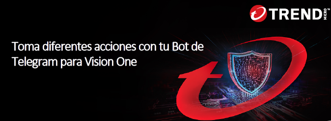
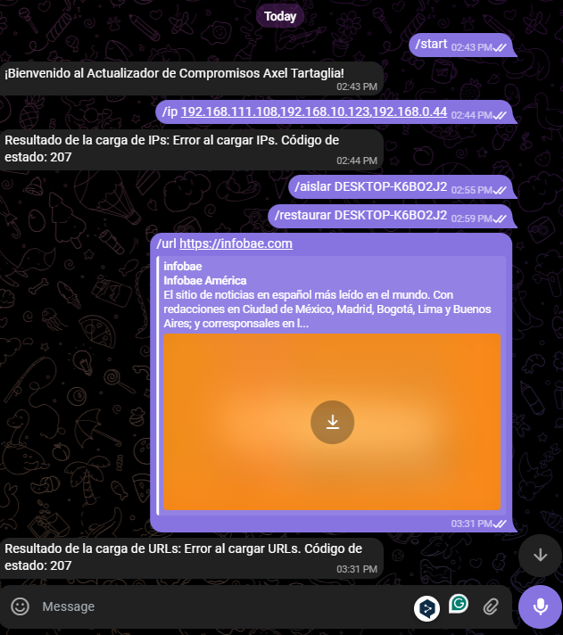
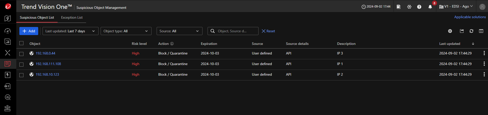
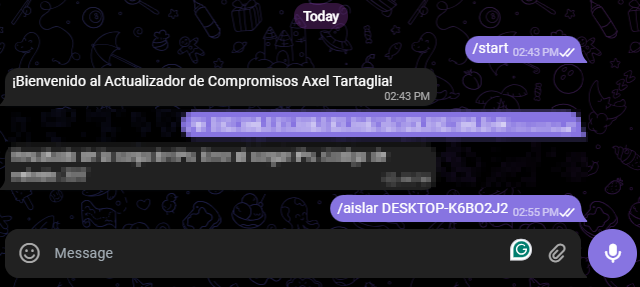
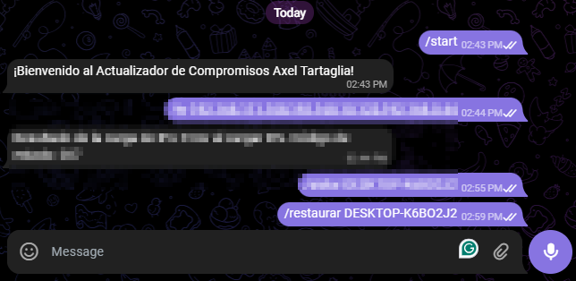
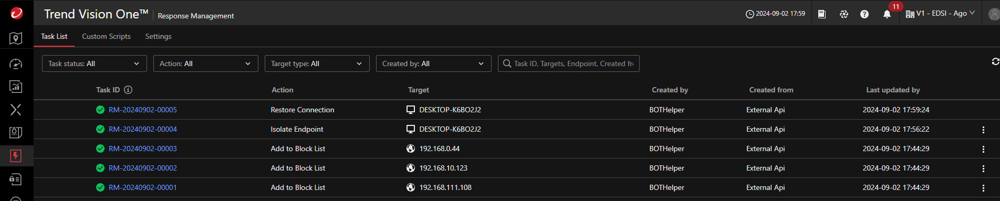

<p align="center">

</p>

# Telegram Vision One Bot :robot:

Toma acciones en tu consola de Vision One por mensaje. El Bot se encargará de realizar el trabajo.

### Crea tu BOT de Telegram con BotFather y genera tu Token

[How To](https://core.telegram.org/bots)
<p align="center">

</p>

### Pasos

#### Descarga el Proyecto

```bash
git clone git@github.com:Gig-Jag/Telegram
```

#### Construir la imagen

```bash
docker build -t bot .
```

#### Ejecutar el contenedor

```bash
docker run -e TOKEN_TELEGRAM="YOUR_TELEGRAM_TOKEN" bot
```

Diálogo entre el BOT y el Administrador, donde se le informa las instrucciones para realizar e impactar en su consola de Vision One. Utilizando el comando /help le proporcionara las posibiles acciones que pueda realizar.

<p align="center">

</p>
<p align="center">

</p>

## Proceso :robot:

Dentro de la consola Trend Micro Vision One, debemos generar un API Key la cual va a ser utilizada por el BOT.
Debemos editar el archivo engine.py, modificando el parametro token y agregaremos el valor de la API Key que nos otorga la consola de Vision One.

### Envío IoC al Bot

<p align="center">

</p>

### Impacto del IoC en Trend Micro Vision One

<p align="center">

</p>

### Indicarle al Bot que aisle un Endpoint

<p align="center">

</p>

### Indicarle al Bot que restablezca un Endpoint

<p align="center">

</p>

### Tareas realizadas Trend Micro Vision One

<p align="center">

</p>
