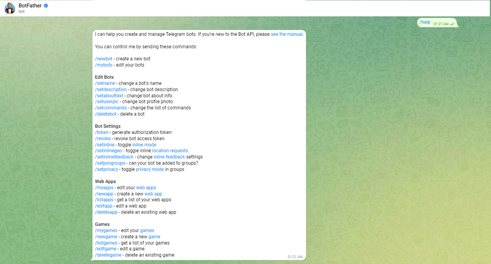
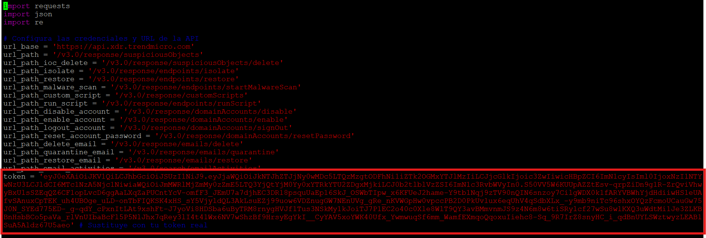
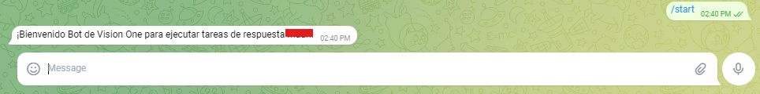
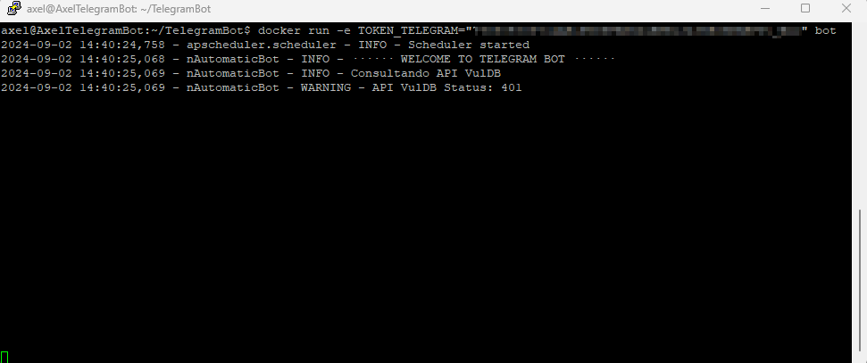
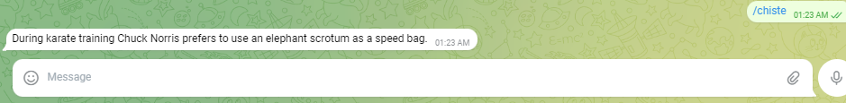
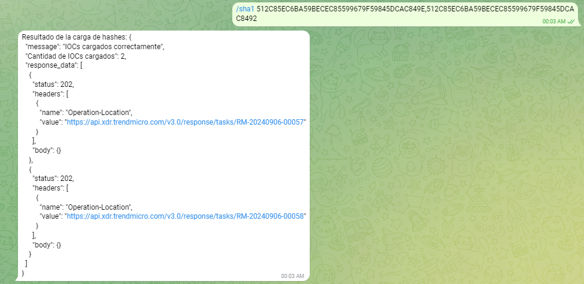
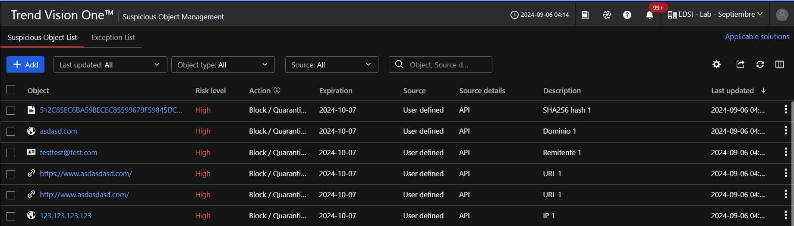
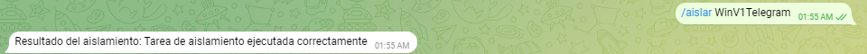

<p align="center">

</p>

# BOT Telegram & Vision One :robot:

Toma acciones en tu consola de Vision One por mensaje. El Bot se encargará de realizar el trabajo.

### Crea tu BOT de Telegram con BotFather y genera tu Token

[How To](https://core.telegram.org/bots)
<p align="center">

</p>

### Pasos

#### Crea la VM

```bash
Se necesita un S.O Ubuntu.
```

#### Ajusta sus configuraciones

```bash
sudo apt update
```
```bash
sudo apt upgrade
```
```bash
sudo snap install docker
```
```bash
sudo apt  install podman-docker
```
```bash
sudo apt  install docker.io
```

#### Añade el proyecto como repositorio propio en GitHub

```bash
Sobre el icono "+" y haciendo click sobre "Import Repository"
```

#### Crea la llave de acceso

```bash
ssh-keygen -t rsa -b 4096 -C <"correo electronico">
```

#### Añade la llave de acceso a tu cuenta de GitHub

```bash
Settings --> SSH and GPG Keys
```

#### Descarga el Proyecto

```bash
git clone ssh://git@ssh.github.com:443/MauriA1/TelegramBOT-AGD.git
```

#### Modifique API KEY en el archivo engine.py

<p align="center">

</p>

#### Construir la imagen

```bash
docker build -t bot .
```

#### Creación del BOT de Telegram a través de BotFather

```bash
Buscar BotFather en telegram y seguir los pasos para la creación del BOT y obtener el "Token"
```

#### Ejecutar el contenedor

```bash
docker run -e TOKEN_TELEGRAM="YOUR_TELEGRAM_TOKEN" bot
```

Diálogo entre el BOT y el Administrador, donde se le informa las instrucciones para realizar e impactar en su consola de Vision One. Utilizando el comando /help le proporcionara las posibiles acciones que pueda realizar.

<p align="center">

</p>
<p align="center">

</p>

### Consulta de tareas disponibles

<p align="center">

</p>

## Prueba

Puedo validar que el bot este funcionando ejecutando el comando /chiste en Telegram

<p align="center">

</p>


## Proceso :robot:

Dentro de la consola Trend Micro Vision One, debemos generar un API Key la cual va a ser utilizada por el BOT.
Debemos editar el archivo engine.py, modificando el parametro token y agregaremos el valor de la API Key que nos otorga la consola de Vision One.


*** IMPORTANTE: ASIGNAR SOLO LOS PERMISOS NECESARIOS A LA API KEY ***

### Envío IoC al Bot

<p align="center">

</p>

### Impacto del IoC en Trend Micro Vision One en sección de indicadores de compromiso

<p align="center">

</p>

### Indicarle al Bot que aisle un Endpoint

<p align="center">

</p>

### Indicarle al Bot que restablezca un Endpoint

<p align="center">

</p>

### Impacto del acciones de respuesta globales en Trend Micro Vision One

<p align="center">

</p>
